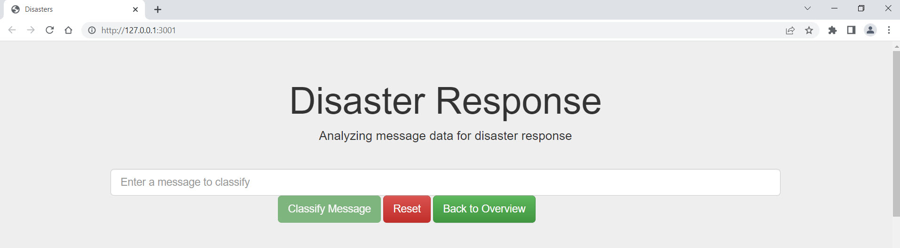
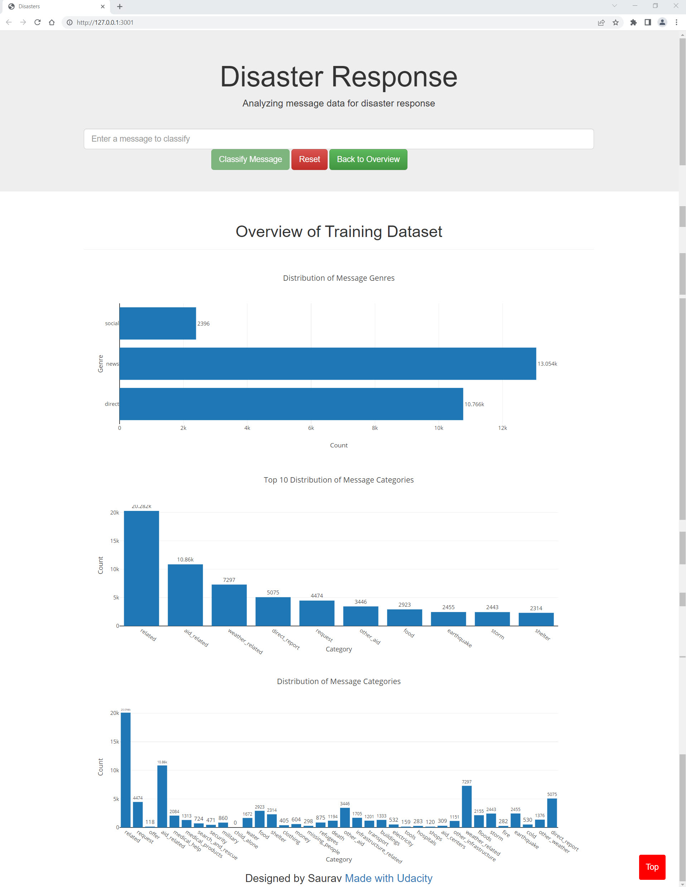
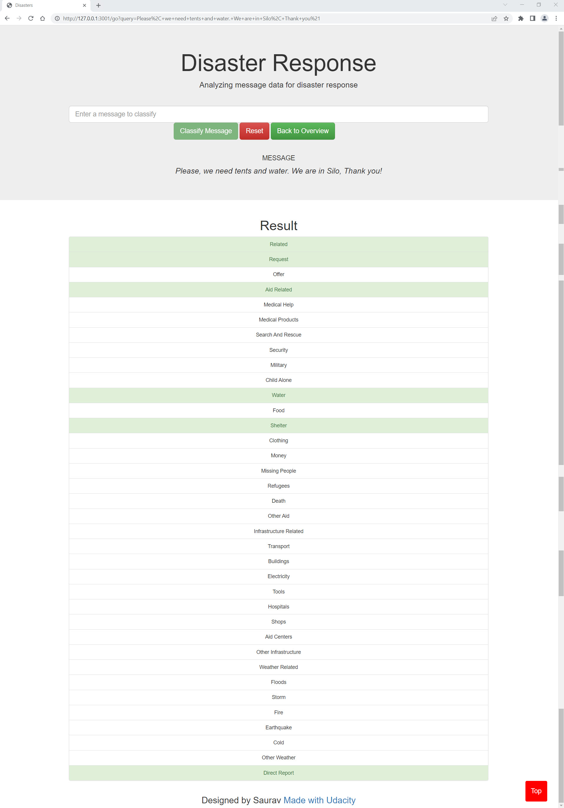

# Disaster Response Pipeline Project



## Table of Contents
1. [Introduction](#Introduction)
2. [Dependencies](#Dependencies)
3. [File Structure](#FileStructure)
4. [Execution Instructions](#Execution_Instructions)
5. [Acknowledgement](#acknowledgement)
6. [Screenshots](#screenshots)

<a name="Introduction"></a>
## Introduction

This Project is part of Data Science Nanodegree Program by Udacity.
The initial dataset contains pre-labelled tweet and messages from real-life disaster. 
The aim of the project is to build tool using a natural language processing, and machine learning skills to analyze message data that people sent during disasters to build a model for an API that classifies disaster messages.

The Project is divided in the following Sections:

1. Data Processing, ETL Pipeline to extract data from source, clean data and save them in a proper database structure
2. Machine Learning Pipeline to train a model able to classify text message in categories
3. Web App to show model results in real time. 


<a name="Dependencies"></a>
### Dependencies
* Python 3.5+ (I used Python 3.7)
* Machine Learning Libraries: NumPy, SciPy, Pandas, Sciki-Learn
* Natural Language Process Libraries: NLTK
* SQLlite Database Libraqries: SQLalchemy
* Web App and Data Visualization: Flask, Plotly


<a name="FileStructure"></a>
### File Structure
```
- app
|- template
| |-- master.html # main page of web app
| |-- go.html # classification result page of web app
|- run.py # Flask file that runs app

- data
|- disaster_categories.csv # data to process
|- disaster_messages.csv # data to process
|- DisasterResponse.db # database to save clean data to
|- ETL Pipeline Preparation.ipynb
|- process_data.py

- models

|- classifier.pkl # saved model
|- ML Pipeline Preparation.ipynb
|- train_classifier.py

README.md
```
<a name="Execution_Instructions"></a>
### Execution Instructions:

I'm using PyCharm 2022.2 Software for developing and running code. 

1. Run ETL pipeline that cleans data and stores in database
2. Run ML pipeline that trains classifier and saves
3. Run the run.py file from the app's directory to run your web portal. 
4. Once run.py start running on development server you can launch web portal on browser using address http://127.0.0.1:3001


<a name="acknowledgement"></a>
## Acknowledgements

* [Udacity](https://www.udacity.com/) for providing such a complete Data Science Nanodegree Program


<a name="screenshots"></a>
## Screenshots

1. Main page shows the Overview of Training Dataset & Distribution of Message Categories



2. After clicking **Classify Message**, you can see the categories which the message belongs to highlighted in green



